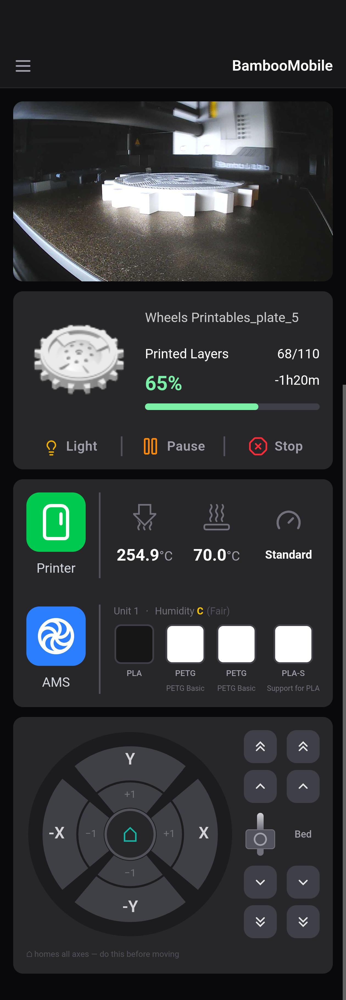
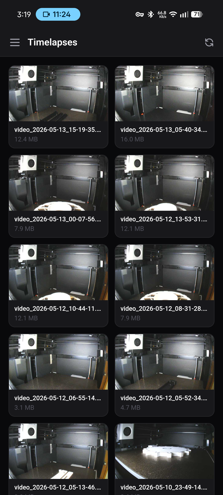

# BambooMobile

A mobile-first companion app for Bambu Lab printers that works entirely over your local network! **no Bambu cloud, no account required.**

Built with [Tauri v2](https://tauri.app/) (Rust backend) + React/TypeScript frontend, targeting Android.

---

## ⚠️ Disclaimer

Yes, this was vibe coded. Mostly the backend logic, with Claude. If you don't like it you can either fork it and rewrite it yourself or leave the repo. I don't know Rust and I don't even want to try and understand how BambuLab printers communicate commands. There are probably some other features or general bug fixes in here that I forgot to document. If you want to whine about it, go do it somewhere I can't hear you please.

The app works on my P1S, if someone else can test it on their printer that'd be great!

---

## Screenshots

|                   Home                   |                    File Manager                    |                  Timelapses                   |                   Printers                   |
| :--------------------------------------: | :------------------------------------------------: | :-------------------------------------------: | :------------------------------------------: |
|  |  |  |  |

---

## Why This Exists (The Right to Repair Angle)

Bambu Lab makes excellent printers. They also make it increasingly difficult to use those printers without going through their cloud infrastructure. The official app requires a Bambu account. Their cloud goes down sometimes. Their API terms can change. And if you're in a region with poor connectivity, or you simply don't want your print data phoning home, you're stuck with whatever the official tooling allows.

This is a right to repair problem. When you buy a $700 printer, you should be able to operate it without a third party's servers being in the way. The printer is on your local network. The MQTT broker is on the printer. The camera stream is on the printer. None of this requires the internet, but Bambu's official apps route through their cloud anyway.

BambooMobile connects directly to your printer over LAN using the same open protocols that tools like [OrcaSlicer](https://github.com/SoftFever/OrcaSlicer) and [LanBu](https://github.com/nicholasgasior/lanbu) use. Everything stays on your network. Your printer data stays yours.

As manufacturers increasingly lock down hardware through software and cloud dependencies, community-built alternatives become more important, not just as conveniences, but as a matter of ownership. You paid for the hardware. You should be able to use it on your own terms, indefinitely, regardless of what happens to any company's servers or business model.

Projects like [OpenBambuAPI](https://github.com/Doridian/OpenBambuAPI) document these protocols so that anyone can build alternatives. That work matters. This app is built on top of it.

---

## Features

- 🔄 **Multiple Printer Support** — switch between printers, automatic local network name detection, and per-printer credential storage.
- 📷 **Live camera feed** — MJPG over TLS on port 6000, pure Rust implementation.
- 📊 **Print status & Controls** — view progress %, layer counter, remaining time, and start (pre-uploaded gcode), pause, resume, or stop prints.
- 🗂️ **File Manager & Timelapses** — FTP (port 990) integration to view, download, delete files, and view model previews.
- 🔔 **App Notifications** — push alerts for print completion and failures.
- 🌡️ **Temperatures** — nozzle and bed with targets, now managed via dedicated UI modals.
- 💡 **Chamber light** toggle (works regardless of whether the printer is running).
- 🎛️ **Print speed** — dedicated dialog for Silent / Standard / Sport / Ludicrous modes.
- 📱 **Refined UI/UX** — pull-to-refresh functionality, improved navigation, intuitive familiar layout, and respects Android safe area insets for edge-to-edge display.
- 🧵 **AMS filament info** — per-unit humidity grade (A–E scale), per-slot type and colour.
- 🪡 **External spool** display.
- 🕹️ **Manual jog controls** — OrcaSlicer-style XY wheel, extruder column, Z/bed row with ±1/±10 mm steps and a home button.
- 🛠️ **MQTT Debug Page** — built-in view for troubleshooting raw telemetry and error handling.
- 💾 **Persistent credentials** — stored in app data via `tauri-plugin-store`, not in browser storage.

---

## Getting Started

### Prerequisites

- [Rust](https://rustup.rs/) + Android NDK (for Android builds)
- [Node.js](https://nodejs.org/) + [pnpm](https://pnpm.io/)
- Tauri CLI v2: `pnpm add -g @tauri-apps/cli`

### Development (desktop)

```bash
pnpm install
pnpm tauri dev
```

### Android build

```bash
pnpm tauri android build
```

You'll need your printer's **IP address**, **access code** (touchscreen → Settings → WLAN), and **serial number**. The app asks for these on first launch and remembers them.

---

## Roadmap / TODO

- [x] **Multiple printer support** — switch between printers, per-printer credential storage, printer picker on launch
- [x] **Print file management over FTP (port 990)**
- [x] **Push notifications for print completion and failures**
- [ ] **MakerWorld-equivalent integration** — some kind of browse/download flow for print files without going through the official app. Not exactly sure what shape this takes yet, but it's on the list. We'll see what's possible.
- [ ] Fan speed control
- [ ] AMS filament remaining percentage (when reported by firmware)

---

## Protocol Notes

For anyone building on top of this:

- **Camera**: TLS on port 6000. Send an 80-byte auth packet (`0x40` LE size, `0x3000` LE type, `"bblp"` at offset 16, access code at offset 48), then read 16-byte frame headers followed by raw JPEG data.
- **MQTT**: TLS on port 8883, credentials `bblp` / `<access_code>`. Subscribe to `device/<serial>/report`, publish to `device/<serial>/request`.
- **TLS**: Bambu printers use self-signed certificates — skip verification.
- Full protocol documentation: [OpenBambuAPI](https://github.com/Doridian/OpenBambuAPI)

---

## License

Do whatever you want with it, but if you fork it and change it, your version has to be open source too. Licensed under the **GNU Affero General Public License v3 (AGPL-3.0)**.
